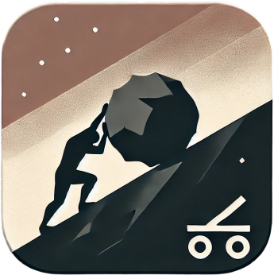

# 🎮 SENSE: The Game

## 🧩 Description

**"SENSE: The Game"** is a unique philosophical game inspired by the myth of Sisyphus, where you are tasked not just with pushing a boulder, but also with seeking answers to life's most profound questions. This game explores the concept of the meaning of life through the lens of absurdity, repetitive actions, and endless cycles.

### 🗿 Story and Gameplay

You take on the role of Sisyphus, who, according to the myth, is condemned to push a boulder to the top of a mountain, only for it to roll back down every time. In the game, each step and each attempt highlight the absurdity of existence and the constant obstacles on the path to achieving your goal.

Each step on the mountain is not just a challenge in the game, but a challenge to yourself.

## 🧑‍💻 Authors

- [IPOleksenko](https://github.com/IPOleksenko) (owner) — Developer and creator of the idea.
- [Vortm4x](https://github.com/Vortm4x) — Developer.
- makarenk0_vlad — 2D artist.

## 📜 License

This project is licensed under the [MIT License][license].

[license]: ./LICENSE

---

> _"One must imagine Sisyphus happy."_ — Albert Camus
